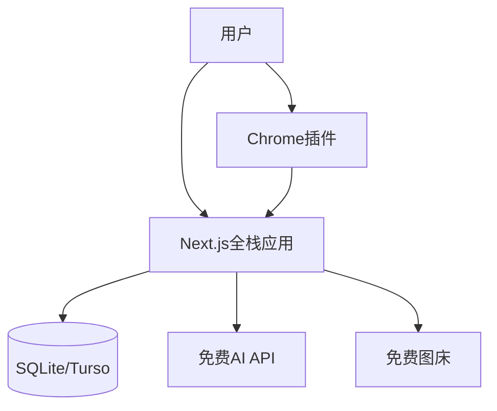

# 字流（ZiLiu）技术实现文档

**版本：** V1.0  
**日期：** 2025-07-24  
**作者：** 孟健  
**目标：** 个人独立开发者最小成本验证

---

## 一、技术架构概览

### 1.1 MVP架构设计



### 1.2 技术栈选择（零成本启动）

| 层级 | 技术选型 | 成本 | 理由 |
|------|----------|------|------|
| **全栈框架** | Next.js 14 + TypeScript | 免费 | 前后端一体，减少复杂度 |
| **数据库** | SQLite + Turso | 免费 | 本地开发SQLite，生产用Turso免费版 |
| **ORM** | Drizzle ORM | 免费 | 轻量级，TypeScript原生 |
| **部署** | Vercel | 免费 | 前后端一键部署，免费额度充足 |
| **认证** | NextAuth.js | 免费 | 内置认证方案 |
| **UI组件** | shadcn/ui + Tailwind | 免费 | 高质量组件，完全可定制 |

---

## 二、项目结构

### 2.1 目录结构

```text
ziliu/
├── src/
│   ├── app/                 # App Router (Next.js 14)
│   │   ├── (auth)/         # 认证相关页面
│   │   │   ├── signin/page.tsx
│   │   │   └── signup/page.tsx
│   │   ├── dashboard/      # 工作台
│   │   │   └── page.tsx
│   │   ├── editor/         # 编辑器
│   │   │   └── new/page.tsx
│   │   ├── api/           # API路由
│   │   │   ├── auth/[...nextauth]/route.ts
│   │   │   ├── articles/route.ts
│   │   │   └── convert/route.ts
│   │   ├── layout.tsx
│   │   ├── page.tsx
│   │   └── globals.css
│   ├── components/         # 组件
│   │   ├── ui/            # shadcn/ui组件
│   │   ├── editor/        # 编辑器组件
│   │   └── layout/        # 布局组件
│   ├── lib/               # 工具库
│   │   ├── db.ts          # 数据库连接
│   │   ├── auth.ts        # 认证配置
│   │   └── utils.ts       # 工具函数
│   └── types/             # TypeScript类型
├── drizzle/               # 数据库Schema
│   └── schema.ts
├── extension/             # Chrome插件
│   ├── manifest.json
│   ├── content.js
│   ├── popup.html
│   └── popup.js
└── public/                # 静态资源
```

---

## 三、数据库设计

### 3.1 核心表结构（Drizzle Schema）

```typescript
// drizzle/schema.ts
import { sqliteTable, text, integer } from 'drizzle-orm/sqlite-core';

// 用户表
export const users = sqliteTable('users', {
  id: text('id').primaryKey(),
  email: text('email').notNull().unique(),
  name: text('name'),
  avatar: text('avatar'),
  passwordHash: text('password_hash'),
  createdAt: integer('created_at', { mode: 'timestamp' }).notNull(),
  updatedAt: integer('updated_at', { mode: 'timestamp' }).notNull(),
});

// 文章表
export const articles = sqliteTable('articles', {
  id: text('id').primaryKey(),
  userId: text('user_id').notNull().references(() => users.id),
  title: text('title').notNull(),
  content: text('content').notNull(),
  status: text('status').notNull().default('draft'), // draft, published
  wordCount: integer('word_count').default(0),
  createdAt: integer('created_at', { mode: 'timestamp' }).notNull(),
  updatedAt: integer('updated_at', { mode: 'timestamp' }).notNull(),
});

// 发布记录表
export const publishRecords = sqliteTable('publish_records', {
  id: text('id').primaryKey(),
  articleId: text('article_id').notNull().references(() => articles.id),
  platform: text('platform').notNull(), // wechat, zhihu, juejin
  status: text('status').notNull().default('pending'),
  publishedAt: integer('published_at', { mode: 'timestamp' }),
  createdAt: integer('created_at', { mode: 'timestamp' }).notNull(),
});
```

### 3.2 数据库配置

```typescript
// lib/db.ts
import { drizzle } from 'drizzle-orm/libsql';
import { createClient } from '@libsql/client';
import * as schema from '../drizzle/schema';

const client = createClient({
  url: process.env.TURSO_DATABASE_URL!,
  authToken: process.env.TURSO_AUTH_TOKEN!,
});

export const db = drizzle(client, { schema });
export { users, articles, publishRecords } from '../drizzle/schema';
```

---

## 四、核心功能实现

### 4.1 NextAuth.js认证配置

```typescript
// lib/auth.ts
import NextAuth, { NextAuthOptions } from 'next-auth';
import CredentialsProvider from 'next-auth/providers/credentials';
import { db, users } from './db';
import { eq } from 'drizzle-orm';
import bcrypt from 'bcryptjs';
import { z } from 'zod';

const loginSchema = z.object({
  email: z.string().email(),
  password: z.string().min(6),
});

export const authOptions: NextAuthOptions = {
  providers: [
    CredentialsProvider({
      name: 'credentials',
      credentials: {
        email: { label: 'Email', type: 'email' },
        password: { label: 'Password', type: 'password' }
      },
      async authorize(credentials) {
        try {
          if (!credentials?.email || !credentials?.password) {
            return null;
          }

          const { email, password } = loginSchema.parse(credentials);
          
          const user = await db.query.users.findFirst({
            where: eq(users.email, email)
          });
          
          if (!user || !user.passwordHash) {
            return null;
          }
          
          const isValidPassword = await bcrypt.compare(password, user.passwordHash);
          if (!isValidPassword) {
            return null;
          }
          
          return {
            id: user.id,
            email: user.email,
            name: user.name,
            image: user.avatar,
          };
        } catch (error) {
          console.error('Auth error:', error);
          return null;
        }
      }
    })
  ],
  session: {
    strategy: 'jwt',
  },
  pages: {
    signIn: '/auth/signin',
  },
  callbacks: {
    async jwt({ token, user }) {
      if (user) {
        token.id = user.id;
      }
      return token;
    },
    async session({ session, token }) {
      if (token && session.user) {
        session.user.id = token.id as string;
      }
      return session;
    },
  },
};

const handler = NextAuth(authOptions);
export { handler as GET, handler as POST };

// Helper function to get session on server side
export async function getServerSession() {
  const { getServerSession } = await import('next-auth/next');
  return getServerSession(authOptions);
}
```

### 4.2 格式转换功能

```typescript
// lib/converter.ts
import { marked } from 'marked';

// 公众号样式模板
const WECHAT_STYLES = {
  default: `
    <style>
      .wechat-content { 
        font-family: -apple-system, BlinkMacSystemFont, "Segoe UI", Roboto; 
        line-height: 1.8; 
        color: #333; 
      }
      .wechat-content h1 { 
        color: #2c3e50; 
        border-bottom: 2px solid #3498db; 
        padding-bottom: 8px; 
        margin: 24px 0 16px 0;
      }
      .wechat-content h2 { 
        color: #34495e; 
        border-left: 4px solid #3498db; 
        padding-left: 12px; 
        margin: 20px 0 12px 0;
      }
      .wechat-content p { 
        margin: 16px 0; 
        text-align: justify;
      }
      .wechat-content code { 
        background: #f8f9fa; 
        padding: 2px 6px; 
        border-radius: 3px; 
        font-family: 'SF Mono', Monaco, monospace;
        color: #e74c3c;
      }
      .wechat-content pre { 
        background: #f8f9fa; 
        padding: 16px; 
        border-radius: 8px; 
        overflow-x: auto;
        border-left: 4px solid #3498db;
      }
      .wechat-content blockquote { 
        border-left: 4px solid #bdc3c7; 
        padding-left: 16px; 
        margin: 16px 0; 
        color: #7f8c8d;
        font-style: italic;
      }
    </style>
  `,
  tech: `
    <style>
      .wechat-content { 
        font-family: "SF Mono", Monaco, "Cascadia Code", monospace; 
        line-height: 1.6;
      }
      .wechat-content h1 { 
        background: linear-gradient(45deg, #667eea 0%, #764ba2 100%);
        -webkit-background-clip: text;
        -webkit-text-fill-color: transparent;
        font-weight: bold;
      }
      .wechat-content pre { 
        background: #282c34; 
        color: #abb2bf; 
        padding: 16px; 
        border-radius: 8px; 
        overflow-x: auto;
      }
    </style>
  `,
  minimal: `
    <style>
      .wechat-content { 
        font-family: "PingFang SC", "Hiragino Sans GB", sans-serif; 
        line-height: 2;
        color: #444;
      }
      .wechat-content h1 { 
        font-weight: 300; 
        color: #333; 
        text-align: center;
        margin: 32px 0;
      }
      .wechat-content p { 
        color: #666; 
        margin: 20px 0;
      }
    </style>
  `
};

export function convertToWechat(
  markdown: string, 
  style: keyof typeof WECHAT_STYLES = 'default'
): string {
  const html = marked(markdown);
  return `
    ${WECHAT_STYLES[style]}
    <div class="wechat-content">
      ${html}
    </div>
  `;
}

// 计算字数和阅读时间
export function calculateStats(content: string) {
  const wordCount = content.replace(/\s/g, '').length;
  const readingTime = Math.ceil(wordCount / 300); // 假设每分钟阅读300字
  return { wordCount, readingTime };
}
```

---

## 五、API设计

### 5.1 文章管理API

```typescript
// app/api/articles/route.ts
import { NextRequest, NextResponse } from 'next/server';
import { getServerSession } from '@/lib/auth';
import { db, articles } from '@/lib/db';
import { eq } from 'drizzle-orm';
import { nanoid } from 'nanoid';

export async function GET(request: NextRequest) {
  try {
    const session = await getServerSession();
    if (!session?.user?.id) {
      return NextResponse.json({ error: 'Unauthorized' }, { status: 401 });
    }

    const userArticles = await db.query.articles.findMany({
      where: eq(articles.userId, session.user.id),
      orderBy: (articles, { desc }) => [desc(articles.updatedAt)],
    });

    return NextResponse.json({ articles: userArticles });
  } catch (error) {
    return NextResponse.json({ error: 'Internal error' }, { status: 500 });
  }
}

export async function POST(request: NextRequest) {
  try {
    const session = await getServerSession();
    if (!session?.user?.id) {
      return NextResponse.json({ error: 'Unauthorized' }, { status: 401 });
    }

    const { title, content } = await request.json();
    const now = new Date();
    
    const article = await db.insert(articles).values({
      id: nanoid(),
      userId: session.user.id,
      title: title || '未命名文章',
      content: content || '',
      status: 'draft',
      wordCount: content?.replace(/\s/g, '').length || 0,
      createdAt: now,
      updatedAt: now,
    }).returning();

    return NextResponse.json({ article: article[0] });
  } catch (error) {
    return NextResponse.json({ error: 'Internal error' }, { status: 500 });
  }
}
```

### 5.2 格式转换API

```typescript
// app/api/convert/route.ts
import { NextRequest, NextResponse } from 'next/server';
import { convertToWechat, calculateStats } from '@/lib/converter';

export async function POST(request: NextRequest) {
  try {
    const { content, platform, style } = await request.json();
    
    if (platform === 'wechat') {
      const html = convertToWechat(content, style);
      const stats = calculateStats(content);
      
      return NextResponse.json({ 
        html, 
        wordCount: stats.wordCount,
        readingTime: stats.readingTime 
      });
    }
    
    return NextResponse.json({ error: 'Unsupported platform' }, { status: 400 });
  } catch (error) {
    return NextResponse.json({ error: 'Conversion failed' }, { status: 500 });
  }
}
```

---

## 六、Chrome插件

### 6.1 Manifest配置

```json
{
  "manifest_version": 3,
  "name": "字流助手",
  "version": "1.0.0",
  "description": "一键填充公众号内容",
  "permissions": ["activeTab", "storage"],
  "content_scripts": [
    {
      "matches": ["*://mp.weixin.qq.com/*"],
      "js": ["content.js"]
    }
  ],
  "action": {
    "default_popup": "popup.html",
    "default_title": "字流助手"
  }
}
```

### 6.2 内容脚本

```javascript
// content.js
(function() {
  chrome.runtime.onMessage.addListener((message, sender, sendResponse) => {
    if (message.action === 'fillContent') {
      fillWechatEditor(message.data);
      sendResponse({ success: true });
    }
  });

  function fillWechatEditor(data) {
    // 填充标题
    const titleInput = document.querySelector('#title');
    if (titleInput) {
      titleInput.value = data.title;
      titleInput.dispatchEvent(new Event('input', { bubbles: true }));
    }

    // 填充内容
    const contentEditor = document.querySelector('#ueditor_0');
    if (contentEditor) {
      contentEditor.innerHTML = data.content;
    }

    showNotification('内容填充成功！');
  }

  function showNotification(message) {
    const notification = document.createElement('div');
    notification.textContent = message;
    notification.style.cssText = `
      position: fixed; top: 20px; right: 20px; z-index: 9999;
      background: #4CAF50; color: white; padding: 12px 20px;
      border-radius: 4px; font-size: 14px;
    `;
    document.body.appendChild(notification);
    setTimeout(() => notification.remove(), 3000);
  }
})();
```

---

## 七、部署配置

### 7.1 环境变量

```bash
# .env.local
TURSO_DATABASE_URL="libsql://your-db.turso.io"
TURSO_AUTH_TOKEN="your-auth-token"
NEXTAUTH_SECRET="your-secret-key"
NEXTAUTH_URL="https://your-app.vercel.app"

# 开发环境
DATABASE_URL="file:./dev.db"
```

### 7.2 Vercel部署配置

```json
// vercel.json
{
  "framework": "nextjs",
  "buildCommand": "npm run build",
  "devCommand": "npm run dev",
  "installCommand": "npm install"
}
```

### 7.3 成本分析

| 服务 | 免费额度 | 预估使用 | 成本 |
|------|----------|----------|------|
| **Vercel** | 100GB带宽/月 | 10GB/月 | ¥0 |
| **Turso** | 500MB存储 + 1万次读写 | 100MB + 5000次 | ¥0 |
| **域名** | 使用vercel.app子域名 | - | ¥0 |
| **SSL证书** | Vercel自动提供 | - | ¥0 |
| **CDN** | Vercel Edge Network | - | ¥0 |
| **总计** | - | - | **¥0/月** |

**扩展成本预估：**
- 用户增长到1000人时，可能需要升级Turso（$25/月）
- 需要自定义域名时（¥50/年）
- 总体月成本控制在¥200以内

---

## 八、开发指南

### 8.1 快速启动

```bash
# 1. 克隆项目
git clone https://github.com/your-username/ziliu.git
cd ziliu

# 2. 安装依赖
npm install

# 3. 配置环境变量
cp .env.example .env.local

# 4. 初始化数据库
npm run db:push

# 5. 启动开发服务器
npm run dev
```

### 8.2 开发命令

```bash
# 开发服务器
npm run dev

# 构建项目
npm run build

# 数据库操作
npm run db:push      # 推送schema到数据库
npm run db:studio    # 打开数据库管理界面

# 代码检查
npm run lint
npm run type-check
```

### 8.3 MVP开发路线图

**第一周：项目初始化**
- Day 1-2: 项目搭建，数据库配置
- Day 3-5: 基础架构，UI组件
- Day 6-7: 用户认证系统

**第二周：核心编辑器**
- Day 8-10: Markdown编辑器开发
- Day 11-14: 格式转换功能

**第三周：Chrome插件**
- Day 15-17: 插件开发
- Day 18-21: 集成测试，部署上线

---

## 九、技术选型理由

### 9.1 为什么选择这个技术栈？

1. **零成本启动** - 所有服务都有充足的免费额度
2. **快速开发** - Next.js全栈，减少配置复杂度
3. **易于维护** - TypeScript + 现代工具链
4. **可扩展性** - 后期可平滑升级到付费服务

### 9.2 成本对比

**传统方案年成本：¥4500**
- 云服务器：¥2400
- 数据库：¥1200  
- CDN：¥600
- 其他：¥300

**MVP方案年成本：¥100**
- 域名：¥100 (可选)
- 其他：¥0

**节省成本：98%**

### 9.3 MVP成功指标

**技术指标：**
- 页面加载时间 < 2秒
- 99%正常运行时间
- 编辑器响应时间 < 100ms

**业务指标：**
- 100个真实用户注册
- 50%用户完成完整发布流程
- 收集20个有效用户反馈

**成本控制：**
- 开发成本：个人时间投入（3周全职）
- 运营成本：¥0/月（免费服务额度内）
- 验证成本：总计 < ¥500（域名等可选费用）

---

*本文档涵盖了字流MVP的完整技术实现，专为个人独立开发者设计的零成本验证方案。*
